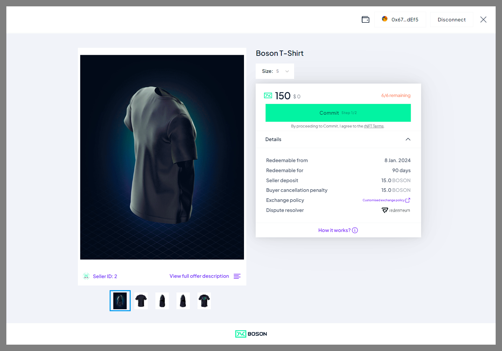

[](https://bosonprotocol.io)

< [Boson Protocol Widgets](../README.md)

# The Commit Widget 

## Integrating ‘Commit’ functionality using the Boson Widget

With the Boson Commit Widget Sellers can allow their customers to commit to a Boson offer on their own domains.

The Boson Commit Widget allows Sellers to simply embed, via a few lines of code, commit functionality of their products into an existing website.



To integrate the Boson Commit Widget, all a seller needs to do is:

 1. Add the following `<script>` entry, either in `<head>` or `<body>` of their website:
```
<script async type="text/javascript" src="https://widgets.bosonprotocol.io/scripts/boson-widgets.js"></script>
```

 2. The Seller then needs to create a button with the fragment identifier *id="boson-commit"*. When clicked, the commit modal will popup on the Seller's website.
``` 
<button type="button" id="boson-commit" data-config-id="production-137-0" data-seller-id="2" data-product-uuid="2540b-1cf7-26e7-ddaf-4de1dcf7ebc">Show Commit</button>
```

The button shall be parameterized with the following arguments:
- ```data-config-id```: specifies the Boson Configuration addressed by the widget (here ***production-137-0*** is the production configuration deployed on the Polygon blockchain). See [Boson Environment](./boson-environments.md) to get more details.
- ```data-seller-id```: specifies the Boson Seller ID that publishes the Product being offered with the plugin
- ```data-product-uuid```: specified the ProductUUID of the Product being offered with the plugin

When a user will click the "Show Commit" button, the Commit Widget will popup and allow the user to:
- show details about the specified Product
- connect their web3 wallet
- commit to the Product (assuming they have connected their wallet, and have enough funds to commit)

## Using the Boson Commit Button

As a seller you can also choose to use the Boson branded "Commit" Button on your website, if you would like to do this, all you need to do is: 

 1. Add the below 2 lines of code in HTML `<head>` section:
```
 <head>
    ...
    <meta name="viewport" content="width=device-width, initial-scale=1.0">
    <link rel="stylesheet" href="https://widgets.bosonprotocol.io/styles.css">
  </head>
```

2. Add the below class name to the "boson-commit" button:
```
<button type="button" id="boson-commit" class="bosonButton" data-config-id="production-137-0" data-seller-id="2" data-product-uuid="2540b-1cf7-26e7-ddaf-4de1dcf7ebc">Commit</button>
```


## Integrating the Commit Widget as an iFrame

Instead of using the Commit Button as shown above, the Commit widget can be embedded in any web page using an iFrame HTML tag.

For instance:
```
<iframe src="https://widgets.bosonprotocol.io/#/commit?configId=production-137-0&sellerId=2&productUuid=2540b-1cf7-26e7-ddaf-4de1dcf7ebc"></iframe>
```

In which case the page:
- does not need to include any specific line (like the ```<script>``` tag for ```boson-widgets.js```)
- shall manage itself the logic to show and hide the iFrame, and the parameters to pass to its URL.
- the expected parameters are:
- ```configId```: specifies the Boson Configuration addressed by the widget (here ***production-137-0*** is the production configuration deployed on the Polygon blockchain). See [Boson Environment](./boson-environments.md) to get more details.
- ```sellerId```: specifies the Boson Seller ID that publishes the Product being offered with the plugin
- ```productUuid```: specifies the ProductUUID of the Product being offered with the plugin

## Commit Widget Parameters

The following parameters configures the widget. They must be passed in the widget URL (for instance when building an iFrame).
For instance:
```
<iframe src="https://widgets.bosonprotocol.io/#/commit?configId=production-137-0&sellerId=2&productUuid=2540b-1cf7-26e7-ddaf-4de1dcf7ebc"></iframe>
```

When using the Commit Button, as shown above, the parameters must be passed as HTML attributes to the Button tag. For instance:
```
<button type="button" id="boson-commit" data-config-id="production-137-0" data-seller-id="2" data-product-uuid="2540b-1cf7-26e7-ddaf-4de1dcf7ebc">Commit</button>
```

| URL parameter | HTML attribute | Required | Default Value | Purpose | Example |
| ------ | -------- | ------- | ------- | ------- | ------- |
| configId | data-config-id | yes | none | the Boson Protocol environment the widget is linked to (see [Boson Environments](../boson-environments.md)) | ```"production-137-0"```
| sellerId | data-seller-id | When offerId is not used | none | specifies the Boson Seller ID that publishes the Product being offered with the plugin. | ```"2"```
| productUuid | data-product-uuid | When offerId or bundleUuid are not used | none | specifies the ProductUUID of the Product being offered with the plugin. | ```"2540b-1cf7-26e7-ddaf-4de1dcf7ebc"```
| bundleUuid | data-bundle-uuid | When offerId or productUuid are not used | none | specifies the BundleUUID of a Phygital Offer being offered with the plugin. | ```"4d5262-28cf-d860-06f-6406bd65fa10"```
| offerId | data-offer-id | When sellerId/productUuid or sellerId/bundleUuid are not used | none | specifies the ID of the Offer being offered with the plugin. Note: an offer ID is the low-level identification of the Boson Offer on-chain, while a Product can match several offers, like several variants (size, color, ...)). | ```"1099"```
| account | data-account | no | none | the address of the wallet the widget should accept. When specified, the user can't connect any other wallet that the one specified.  This parameter is optional and can be used if you want to prevent the user to use the Commit Widget if they don't connect with the given wallet. | ```"0x023456789abcd0213456789abcd213456789abcd"```
| lookAndFeel | data-look-and-feel | no | ```"regular"``` | the look and feel for the Widget (```"regular"``` or ```"modal"```). When set to ```"modal"```, allow to define a margin around the widget to be appearing like a modal popup. | ```"modal"```
| modalMargin | data-modal-margin | no | none | the margin to apply around the widget when lookAndFeel is set to ```"modal"``` | ```"5%"```

## Discover more...

The Commit Widget is part of the React Component library from Boson Core Component you can discover on this [Storybook page](https://main--65f314a856a256708dd840ea.chromatic.com/?path=/story/widgets-commit--commit)

You can find an example HTML file which embeds the widgets on the the widgets subdomain : https://widgets.bosonprotocol.io/example.html
