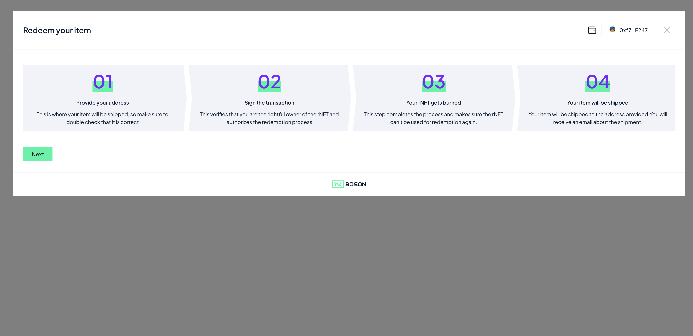
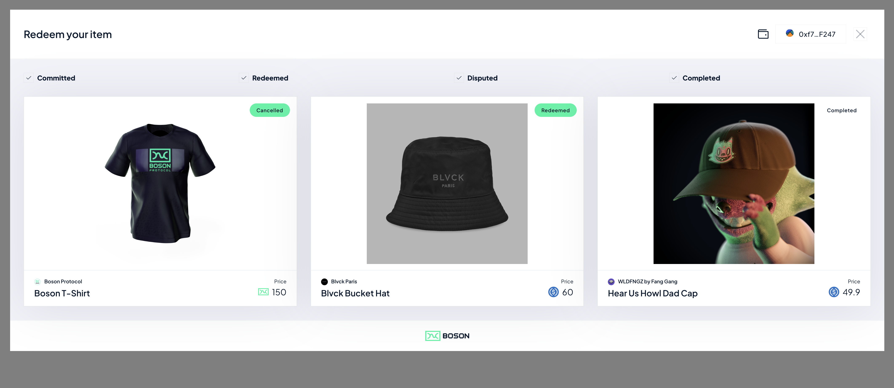
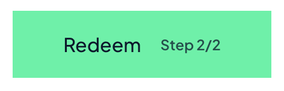

[](https://bosonprotocol.io)

< [Boson Protocol Widgets](../README.md)

# The Redemption Widget 

## Redeeming rNFTs using the Boson Widget

With the release of the Boson Redemption Widget Sellers can now offer redemption of their rNFTs on their own domains.

Sellers can chose to sell their rNFTs everywhere in the metaverse, in game, on NFT marketplaces, or from the Boson dApp whilst bringing users back to their own domain to redeem their NFTs. 

The Boson Redemption Widget allows Sellers to simply embed, via a few lines of code, redemption functionality of their rNFTs into an existing website. 




To integrate the Boson Redemption Widget, all a seller needs to do is:

 1. Add the following `<script>` entry, either in `<head>` or `<body>` of their website:
```
<script async type="text/javascript" src="https://widgets.bosonprotocol.io/scripts/boson-widgets.js"></script>
```

 2. The Seller then needs to create a button with the fragment identifier *id="boson-redeem"*. When clicked, the redeem modal will popup on the Seller's website.
``` 
<button type="button" id="boson-redeem">Show Redeem</button>
```



## Using the Boson Redemption Button

As a seller you can also chose to use the Boson branded "Redeem" Button on your website, if you would like to do this, all you need to do is : 

 1. Add the below 2 lines of code in HTML `<head>` section:
```
 <head>
    ...
    <meta name="viewport" content="width=device-width, initial-scale=1.0">
    <link rel="stylesheet" href="https://widgets.bosonprotocol.io/styles.css">
  </head>
```

2. Add the below class name to the "boson-redeem" button:
```
<button type="button" id="boson-redeem" class="bosonButton">Show Redeem</button>
```




### Redeeming a specific rNFT

The Boson Widget's default behaviour is to show a buyer all of their redeemable vouchers, the widget be configured to direct a buyer to a given rNFT for redemption, this enables different user flows. This the way that the Widget is used on [the Boson dApp](https://bosonapp.io/). 

A Seller can specify which exchange is going to be redeemed by the widget, by:

 1. add a *data-exchange-id* tag to the "boson-redeem" button, specifying the exchangeId of a given exchange:
```
<button type="button" id="boson-redeem" data-exchange-id="80">Redeem Exchange 80</button>
```

You can find an example HTML file which embeds the widgets on the the widgets subdomain : https://widgets.bosonprotocol.io/example.html

### Advanced redemption flows

Hereafter are detailed examples of redemption flows supported by the widget.

- [Default redemption flow](./redemption-widget/default-redemption-flow.md)
- [Marketplace redemption flow](./redemption-widget/marketplace-redemption-flow.md)
- [Redemption with 3rd party eCommerce backend](./redemption-widget/backend-redemption-flow.md)

Widget also supports other usecases:
- [Default cancellation flow](./redemption-widget/default-cancellation-flow.md)
- [Marketplace cancellation flow](./redemption-widget/marketplace-cancellation-flow.md)
- [Raise a dispute on a redeemed exchange](./redemption-widget/raise-dispute-flow.md)
