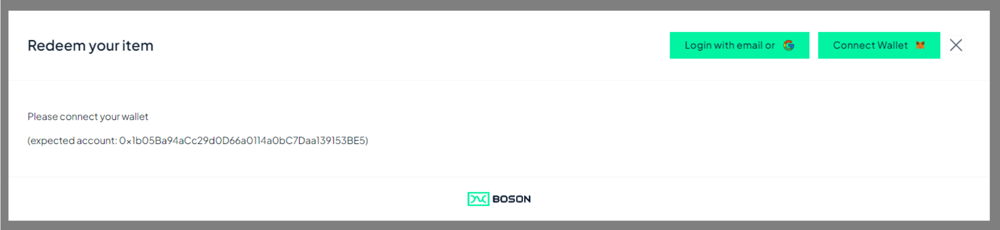

[](https://bosonprotocol.io)

< [Redemption Widget](../redemption-widget.md)

## Redemption Flow with 3rd party eCommerce backend

This flow suppose a 3r-party eCommerce system is used to manage the redemption.

Compared to the [default flow](./default-redemption-flow.md), the main difference is that the delivery information filled by the user is sent via an HTTP POST request to a backend URL passed as a parameter (***postDeliveryInfoUrl***), instead of being sent to the Seller via XMTP.

When replying to the postDeliveryInfo request, it's possible for the backend to decide if the widget should continue to the next step or not. This can be useful:
 - in case the delivery details can't be validated
 - in case the flow needs to interrupt, for instance to perform Shipping Cost checkout before the on-chain transaction is submitted

In addition, the on-chain Redeem transaction submission and confirmation can be relayed to the backend using respective parameters ***postRedemptionSubmittedUrl*** and ***postRedemptionConfirmedUrl***.

If required, every backend request can contain specific headers (for instance used for authentication), passed to the widget using respective parameters ***postDeliveryInfoHeaders***, ***postRedemptionSubmittedHeaders*** and ***postRedemptionConfirmedHeaders***.

### Widget Parameters

| parameter | required | purpose |
| ------ | -------- | ------- |
| configId | yes | the Boson Protocol environment the widget is linked to (see [Boson Environments](../boson-environments.md)) |
| sellerId | no | specifies the sellerId to filter the exchanges shown to the user (step #3 below)
| sellerIds | no | specifies the list of sellerIds to filter the exchanges shown to the user (step #3 below)
| postDeliveryInfoUrl | yes - in this present case | this is the URL to which the widget will post the ***DeliveryInfo*** HTTP request with the delivery Details (step #6.2 below)
| postDeliveryInfoHeaders | no | specifies some request headers that must be added to the ***DeliveryInfo*** HTTP request
| postRedemptionSubmittedUrl | no | this is the URL to which the widget will post the ***RedemptionSubmitted*** HTTP request with the delivery Details (step #6.4 below)
| postRedemptionSubmittedHeaders | no | specifies some request headers that must be added to the ***RedemptionSubmitted*** HTTP request
| postRedemptionConfirmedUrl | no | this is the URL to which the widget will post the ***RedemptionConfirmed*** HTTP request with the delivery Details (step #7 below)
| postRedemptionConfirmedHeaders | no | specifies some request headers that must be added to the ***RedemptionConfirmed*** HTTP request

###  Main Flow (continuous)

When the Seller website activates the Redemption Widget with the adequate options, the user is guided through the following steps.

1. Wallet connection (if needed)
   
   
   In case the user wallet is already connected, this step is ignored

2. Redemption Overview
   
   
   
3. Select Exchange
   
   
   
   Committed exchanges owned by the connected wallet are shown to the user, that are the rNFT owned by the wallet and that the user can redeem. In this example, the ***sellerId*** parameter is used to show only the exchanges of a unique seller.
   
   The user select a rNFT and click it to show the "Exchange Card". Optionally, Redeem button can be directly clicked, that lead the user directly to the Redeem Form

4. Exchange Card
   
   
   This view show details about the exchange, and present a Redeem button (in case the rNFT is redeemable) that the user click to jump to the Redeem Form

5. Redeem Form
   
   
   The user fills in the delivery details to get their physical item delivered

6. Redeem Confirmation
   
   
   
   6.1. User Signature

   First, The user is asked to sign the delivery details with their wallet, to allow the backend to verify the request is coming from the real buyer.

   6.2 POST DeliveryInfo

   Once the message is signed by the wallet, an HTTP request ***post DeliverInfo***  is sent to the backend, containing the delivery information, details about the redeemed exchange, and the user signature.

   The backend should verify, from the signature, that the signer is the buyer wallet, then store the delivery information for this exchange.

   If OK, it must reply to the HTTP request with an OK status (code 200) and a body message like ```{accepted: yes, resume: yes}```.
   - ```accepted: yes``` means the delivery information is accepted so the redemption can be confirmed
   - ```resume: yes``` means the widget can go through the next step to get the redemption confirmed

   6.3 Sign/Send Redemption Transaction

   Now the user is asks to click on **Confirm Redemption** to send the Redeem transaction on-chain (to be signed/confirmed by the user with their wallet)

   6.4 POST Redemption Submitted

   Once the Redeem transaction is signed by the wallet and sent on-chain, an HTTP request ***post RedemptionSubmitted***  is sent to the backend, containing the details about the redeemed exchange, and the expected transaction hash *(Note: the hash of the real transaction may be different than the expected one, for instance in case the wallet resubmits with higher fees, to speed it up)*.

   The backend response to this HTTP request has no effect on the widget flow.

7. Congratulations
   
   Once the Redeem transaction is confirmed on-chain, a congratulation message is shown to the user.

   Once the Redeem transaction is confirmed on-chain, an HTTP request ***post RedemptionConfirmed***  is sent to the backend, containing the details about the redeemed exchange, the effective transaction hash and the blockNumber where the transaction has been validated.

   The backend response to this HTTP request has no effect on the widget flow.

   The user can:
   - close the widget
   - go back to select another rNFT.

#### Complete diagram

.jpg)

### Interrupted Flow

It is possible to interrupt the redemption flow between the delivery details is sent to the backend and the redeem transaction is sent on-chain.

This is useful to allow full redemption to include an additional step or verification between this 2 steps.

Interruption is triggered by the response the backend sends back to the widget when replying to the HTTP ***post DeliverInfo*** request (step #6.2 above).

6. Redeem Confirmation
   
   
   
   6.1. User Signature

   Identical to the continuous flow above.

   6.2 POST DeliveryInfo (interrupted)

   As for the continuous flow, an HTTP request ***post DeliverInfo***  is sent to the backend, which replies with an OK status (code 200) and a body message like ```{accepted: yes, resume: NO}```.
   - ```accepted: yes``` means the delivery information is accepted so the redemption can be confirmed
   - ```resume: NO``` means the widget shall interrupt and not go on with the following step

   The next step is, for the backend, to handle the shipping cost checkout, or any other action required at this stage.
   
   When done, the widget can be called again, with adequate parameters, to end up the redemption flow.

### End of Redemption confirmation, following an interrupted flow

To start the widget directly on the Redemption Confirmation flow, the following parameters shall be set:

| option | required | purpose |
| ------ | -------- | ------- |
| configId | yes | the Boson Protocol environment the widget is linked to (see [Boson Environments](../boson-environments.md)) |
| exchangeId | yes - in this present case | the ID of the exchange being redeemed.
| widgetAction | yes - in this present case | **"CONFIRM_REDEEM"**: the action the widget is going to jump on
| showRedemptionOverview | yes - in this present case | **false**: to skip the Redemption Overview (step #2 above)
| deliveryInfo | yes - in this present case | the delivery details that have been validated by the eCommerce backend for this redemption, shown to the user before they confirm the redemption.
| postDeliveryInfoUrl | yes - in this present case | this is the URL to which the widget will post the ***DeliveryInfo*** HTTP request with the delivery Details (step #6.2 below)
| postDeliveryInfoHeaders | no | optionally specifies some request headers that must be added to the ***DeliveryInfo*** HTTP request
| postRedemptionSubmittedUrl | no | this is the URL to which the widget will post the ***RedemptionSubmitted*** HTTP request with the delivery Details (step #6.4 below)
| postRedemptionSubmittedHeaders | no | optionally specifies some request headers that must be added to the ***RedemptionSubmitted*** HTTP request
| postRedemptionConfirmedUrl | no | this is the URL to which the widget will post the ***RedemptionConfirmed*** HTTP request with the delivery Details (step #7 below)
| postRedemptionConfirmedHeaders | no | optionally specifies some request headers that must be added to the ***RedemptionConfirmed*** HTTP request

6. Redeem Confirmation (follow-up)

   
   
   6.3 Sign/Send Redemption Transaction

   Similarly to the continuous flow, the user is asked to click on **Confirm Redemption** to send the Redeem transaction on-chain (to be signed/confirmed by the user with their wallet)

   *Note that the user can decide to go back to the previous step to Edit the delivery information, that will replay the step 5 and 6 of the redemption flow (possibly interrupted, depending on the backend response)*

   6.4 POST Redemption Submitted

   Identical to the continuous flow.

7. Congratulations
   
   
   Identical to the continuous flow.

#### Complete diagram

.jpg)


