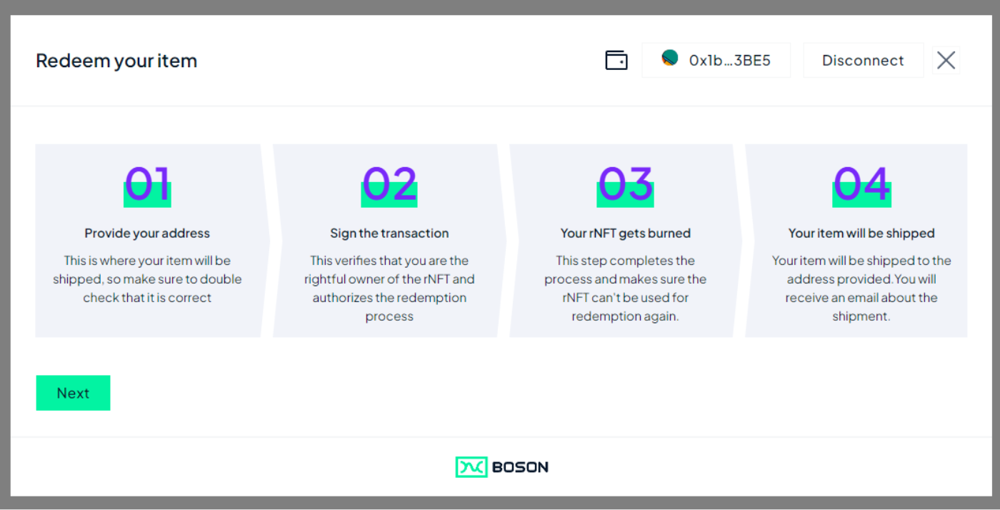
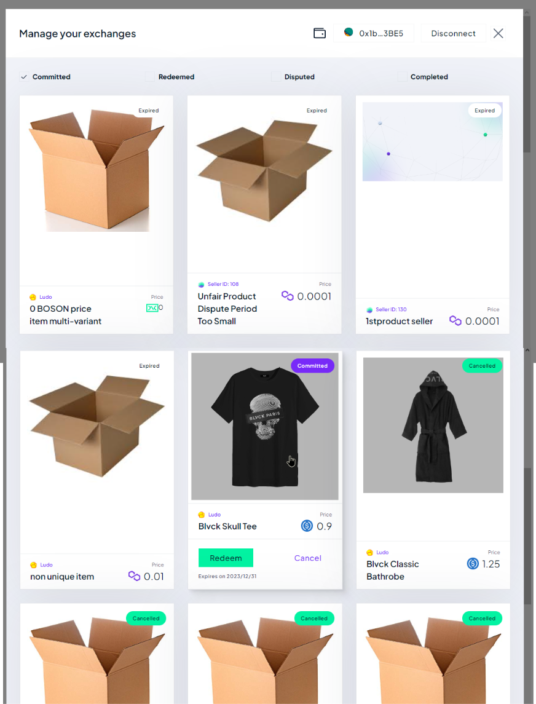

< [Redemption Widget](../redemption-widget.md)

## Default Cancellation Flow

When the Seller website activate the Redemption Widget with the default options, the user is guided through the following steps:

1. Wallet connection (if needed)
   
   In case the user wallet is already connected, this step is ignored

2. Redemption Overview
   
   
3. Select Exchange
   
   
   By default, the Committed exchanges are shown to the user, that are the rNFT owned by the wallet and that the user can cancel.
   
   The user select a rNFT and click it to show the "Exchange Card". Optionally, Cancel button can be directly clicked, that lead the user directly to the Cancel Form

4. Exchange Card
   
   This view show details about the exchange, and present a Cancel button (in case the rNFT is cancellable) that the user clicks to jump to the Cancel Form

5. Cancel Form
   
   The user clicks "Confirm cancellation", that sends the CancelExchange transaction on-chain (to be signed/confirmed by the user with their wallet)

   Once the Cancel transaction is confirmed on-chain, the widget goes back to the Exchange Card.

   The user can:
   - close the widget
   - go back to select another rNFT.