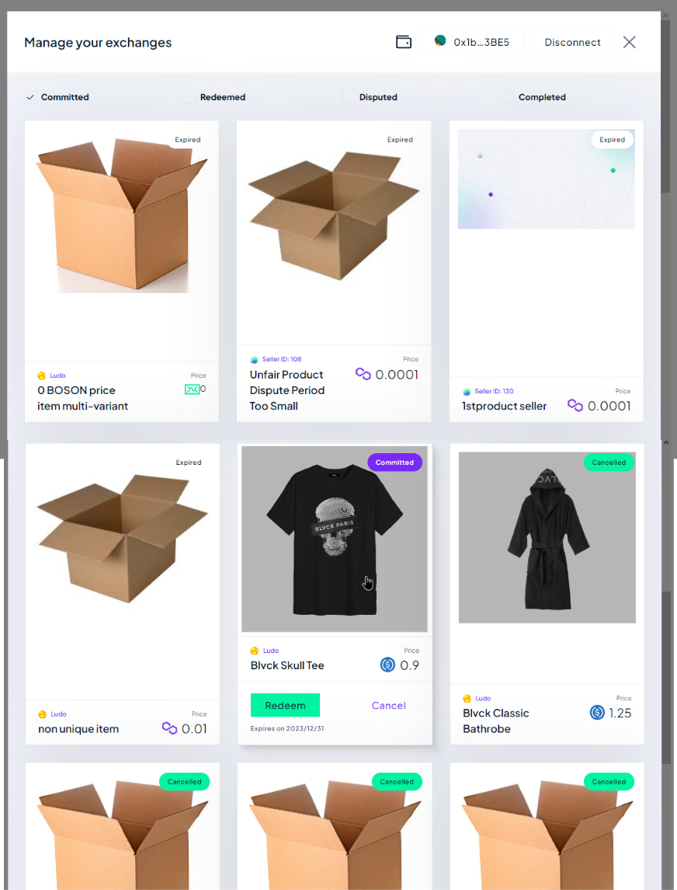
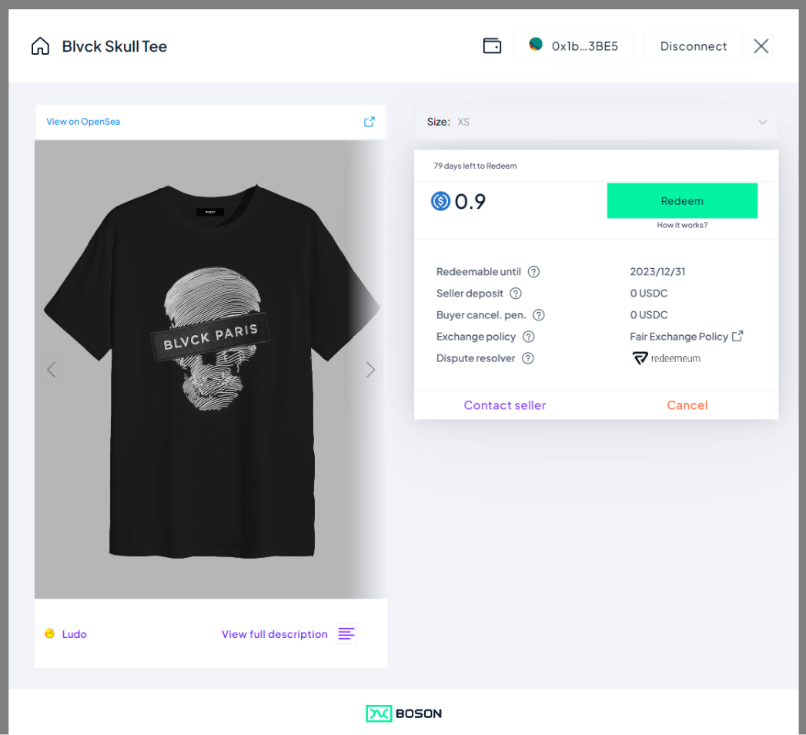
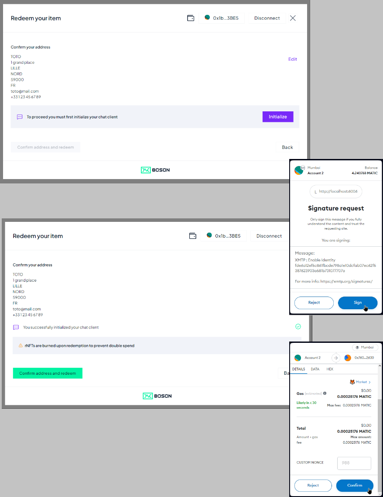
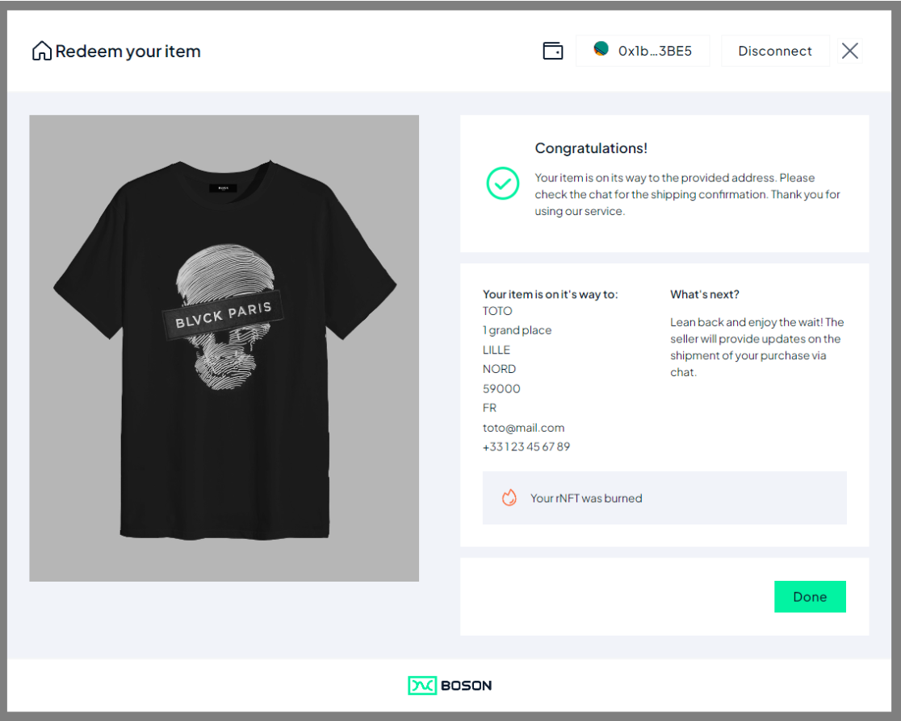

< [Redemption Widget](../redemption-widget.md)

## Default Redemption Flow

When the Seller website activate the Redemption Widget with the default options, the user is guided through the following steps:

1. Wallet connection (if needed)
   
   In case the user wallet is already connected, this step is ignored

2. Redemption Overview
   
   
3. Select Exchange
   
   
   By default, the Committed exchanges are shown to the user, that are the rNFT owned by the wallet and that the user can redeem.
   
   The user select a rNFT and click it to show the "Exchange Card". Optionally, Redeem button can be directly clicked, that lead the user directly to the Redeem Form

4. Exchange Card
   
   This view show details about the exchange, and present a Redeem button (in case the rNFT is redeemable) that the user click to jump to the Redeem Form

5. Redeem Form
   
   The user fills in the delivery details to get their physical item delivered

6. Redeem Confirmation
   
   The user needs to Initialize the Chat layer (signing a message with their wallet) to allow the delivery information to be sent to the Seller. [XMTP](https://xmtp.org/) is used as a chat layer, insuring decentralization and privacy of Buyer/Seller communication

   Once the Chat is Initialized, the user clicks "Confirm address and redeem", that:
   - sends the delivery details to the Seller (via XMTP)
   - sends the Redeem transaction on-chain (to be signed/confirmed by the user with their wallet)

7. Congratulations
   
   Once the Redeem transaction is confirmed on-chain, a congratulation message is shown to the user.

   The user can:
   - close the widget
   - go back to select another rNFT.