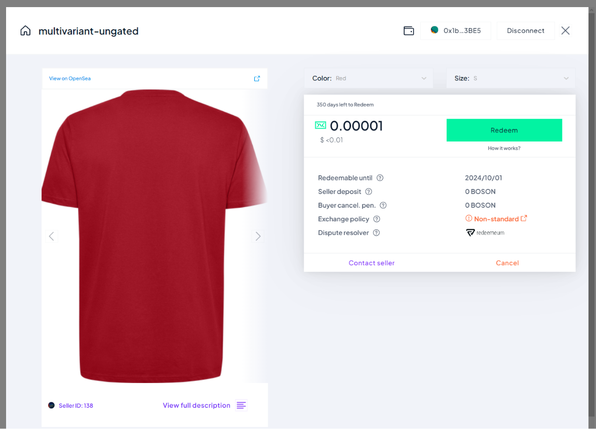

[](https://bosonprotocol.io)

< [Redemption Widget](../redemption-widget.md)

## Redemption Flow with frontend

This flow allows the widget embedded in a web page as an iFrame, to send the redemption information and the transaction progress to the hosting web page.

Compared to the [Redemption flow with backend](./backend-redemption-flow.md), the main difference is that the delivery information filled by the user is sent to the hosting web page using cross-origin communication featured by the web browser (see [reference](https://developer.mozilla.org/en-US/docs/Web/API/Window/postMessage)).

Replying to the `boson-delivery-info` message with a `boson-delivery-info-response` one, is possible for the web page to decide if the widget should continue to the next step or not. This can be useful:
 - in case the delivery details are not valid, in which case the user can provide other delivery details, or choose to cancel the voucher
 - in case the flow needs to be interrupted, for instance, to perform Shipping Cost checkout before the on-chain transaction is submitted.

In addition, the on-chain Redeem transaction submission and confirmation can be relayed to the frontend using appropriate messages (`boson-redemption-submitted` and `boson-redemption-confirmed`).

### Widget Parameters

| parameter | required | purpose |
| ------ | -------- | ------- |
| configId | yes | the Boson Protocol environment the widget is linked to (see [Boson Environments](../boson-environments.md)) |
| sellerIds | no | specifies the list of sellerIds to filter the exchanges shown to the user ([step #3 below](#Select-Exchange))
| signatures | yes | for each seller listed in sellerId, signatures shall contain the signature, by the seller's admin wallet, of the message {"origin":"<parentWindowOrigin>"} where <parentWindowOrigin> is the domain of the page integrating the widget (for instance www.mystore.com)
| sendDeliveryInfoThroughXMTP | yes | whether the widget should send the delivery information to the seller via XMTP
| targetOrigin | yes - in this present case | If set, the widget will send frontend messages (`boson-delivery-info`, `boson-redemption-submitted` and `boson-redemption-confirmed`) to this origin when appropriate
| shouldWaitForResponse | no | whether the widget should wait for a response (`boson-delivery-info-response`) to the deliveryInfo message (`boson-delivery-info`). If false, the widget does not wait and progress further with the redemption flow

###  Main Flow (continuous)

When the Seller website activates the Redemption Widget with the adequate options, the user is guided through the following steps.

1. Wallet connection (if needed)
   
   
   In case the user wallet is already connected, this step is skipped

<div id="showRedemptionOverview"></div>
2. Redemption Overview
   
   

<div id="Select-Exchange"></div>
3. Select Exchange
   
   
   
   Committed exchanges are shown to the user. These are the rNFT owned by the wallet and that the user can redeem. In this example, the ***sellerIds*** parameter is used to show only the exchanges of a unique seller.
   
   The user selects an rNFT and clicks it to show the "Exchange Card". Optionally, the Redeem button can be directly clicked, which leads the user directly to the Redeem Form

4. Exchange Card
   
   
   This view shows details about the exchange, and presents a Redeem button (in case the rNFT is redeemable) that the user can click to jump to the Redeem Form

5. Redeem Form
   
   
   The user fills in the delivery details to get their physical item delivered

6. Redeem Confirmation
   
   
   
   6.1. User Signature

   First, the user is asked to sign the delivery details with their wallet to allow the backend to verify the request is coming from the real buyer.

   <div id="postDeliveryInfo"></div>
   6.2 Post `boson-delivery-info` message

   Once the message is signed by the wallet, a frontend `boson-delivery-info` message is sent to the `targetOrigin`, containing the delivery information, details about the redeemed exchange, and the user signature.

   The receiving frontend might verify, from the signature, that the signer is the buyer wallet, then store the delivery information for this exchange.

   If OK and if `shouldWaitForResponse`, it must reply posting a `boson-delivery-info-response` message with the following content: ```{accepted: yes, resume: yes}```.
   - ```accepted: yes``` means the delivery information is accepted so the redemption can be confirmed
   - ```resume: yes``` means the widget can go through the next step to get the redemption confirmed

   6.3 Sign/Send Redemption Transaction

   Now the user is asked to click on **Confirm Redemption** to send the Redeem transaction on-chain (to be signed/confirmed by the user with their wallet)

   <div id="postRedemptionSubmitted"></div>
   6.4 Post `boson-redemption-submitted` message

   Once the Redeem transaction is signed by the wallet and sent on-chain, a frontend `boson-redemption-submitted` message is sent to the `targetOrigin`, containing the details about the redeemed exchange and the expected transaction hash *(Note: the hash of the real transaction may be different than the expected one, for instance in case the wallet resubmits with higher fees, to speed it up)*.

   No response to this message is expected by the widget.

7. Congratulations
   
   Once the Redeem transaction is confirmed on-chain, a congratulation message is shown to the user.

   <div id="postRedemptionConfirmed"></div>
   Once the Redeem transaction is confirmed on-chain, a frontend `boson-redemption-confirmed` message is sent to the `targetOrigin`, containing the details about the redeemed exchange, the effective transaction hash and the blockNumber where the transaction has been validated.

   No response to this message is expected by the widget.

   The user can:
   - close the widget
   - go back to select another rNFT.

#### Complete diagram


### Interrupted Flow

It is possible, for the hosting web page, to interrupt the redemption flow after the redemption information is set by the user and before the redeem transaction is sent on-chain.

This is useful to allow full redemption to include an additional step or verification between these 2 steps.

Interruption is triggered by the `boson-delivery-info-response` response the `targetOrigin` sends back to the widget when replying to the `boson-delivery-info` message ([step #6.2 above](#postDeliveryInfo)).


6. Redeem Confirmation
   
   
   
   6.1. User Signature

   Identical to the continuous flow above.

   6.2 Post `boson-delivery-info` message (interrupted)

   As for the continuous flow, a frontend `boson-delivery-info` message is sent to the `targetOrigin`, containing the delivery information, details about the redeemed exchange, and the user signature. When `shouldWaitForResponse` is true, the widget waits for a response message (`boson-delivery-info-response`) which is used to interrupt the flow, as follow.
   - ```accepted: yes``` means the delivery information is accepted so the redemption can be confirmed
   - ```resume: NO``` means the widget shall interrupt and not go on with the following step

   The next step is, for the frontend, to close/hide the widget, while dealing with the delivery information.
   
   When done, the widget can be called again, with adequate parameters, to end the redemption flow.

### End of Redemption confirmation, following an interrupted flow

To start the widget directly on the Redemption Confirmation flow, the following parameters shall be set:

| option | required | purpose |
| ------ | -------- | ------- |
| configId | yes | the Boson Protocol environment the widget is linked to (see [Boson Environments](../boson-environments.md)) |
| exchangeId | yes - in this present case | the ID of the exchange being redeemed.
| widgetAction | yes - in this present case | **"CONFIRM_REDEEM"**: the action the widget is going to jump on
| showRedemptionOverview | yes - in this present case | **false**: to skip the Redemption Overview ([step #2 above](#showRedemptionOverview))
| deliveryInfo | yes - in this present case | the delivery details that have been validated by the eCommerce backend for this redemption, shown to the user before they confirm the redemption.
| targetOrigin | yes - in this present case | If set, the widget will send frontend messages (`boson-delivery-info`, `boson-redemption-submitted` and `boson-redemption-confirmed`) to this origin when appropriate
| shouldWaitForResponse | no | whether the widget should wait for a response (`boson-delivery-info-response`) to the deliveryInfo message (`boson-delivery-info`). If false, the widget does not wait and progress further with the redemption flow

6. Redeem Confirmation (follow-up)

   
   
   6.3 Sign/Send Redemption Transaction

   Similarly to the continuous flow, the user is asked to click on **Confirm Redemption** to send the Redeem transaction on-chain (to be signed/confirmed by the user with their wallet)

   *Note that the user can decide to go back to the previous step to Edit the delivery information, that will replay the step 5 and 6 of the redemption flow (possibly interrupted, depending on the frontend response)*

   6.4 Post `boson-redemption-submitted` message

   Identical to the continuous flow.

7. Congratulations
   
   
   Identical to the continuous flow.

#### Complete diagram

.jpg)


