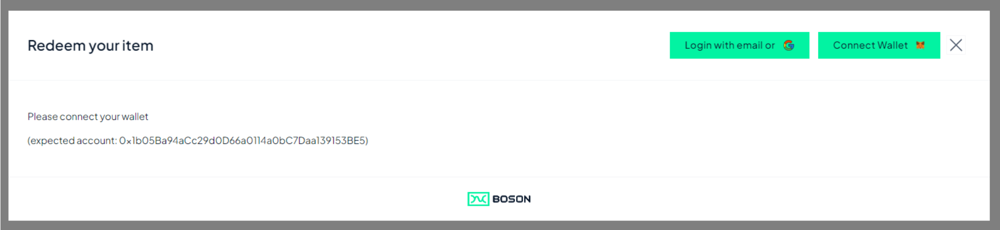
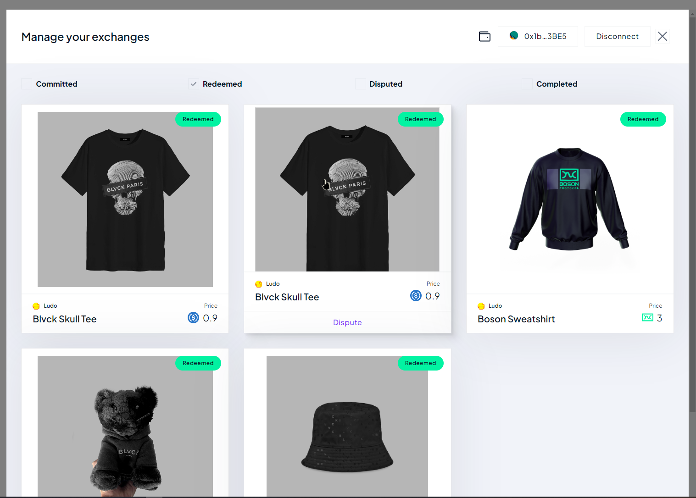
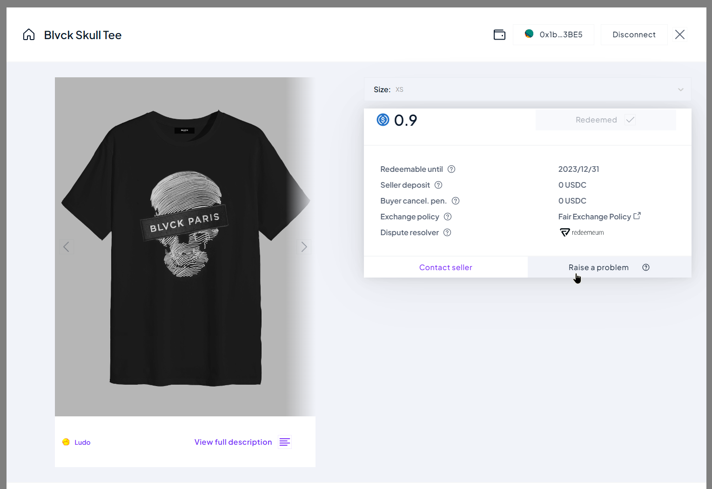

< [Redemption Widget](../redemption-widget.md)

## Raise a Dispute on a Redeemed Exchange

Called with the appropriate parameters, the Redemption Widget can be used to guide the user about ***Raising a Dispute*** on a Redeemed Exchange.

### Widget Parameters

| parameter | required | purpose |
| ------ | -------- | ------- |
| configId | yes | the Boson Protocol environment the widget is linked to (see [Boson Environments](../boson-environments.md)) |
| sellerIds | no | specifies the list of sellerIds to filter the exchanges shown to the user ([step #2 below](#Select-Exchange))
| exchangeState | yes - in this present case | **"Redeemed"**: the status of the exchanges to be shown in the Select Exchange View
| showRedemptionOverview | yes - in this present case | **false**: to skip the Redemption Overview step

###  Raise Dispute Flow

When the Seller website activates the Redemption Widget with the appropriate parameters, the user is guided through the following steps.

1. Wallet connection (if needed)
   
   
   In case the user wallet is already connected, this step is skipped

2. Select Exchange
   
   
   
   Redeemed exchanges of the connected wallet are shown to the user. In this example, the ***sellerIds*** parameter is used to show only the exchanges of a unique seller.
   
   The user can select an exchange and click it to show the "Exchange Card". Optionally, ***Dispute*** button can be clicked, which redirects the user directly to the Dispute Center website (that starts another user flow, outside of the widget).

4. Exchange Card
   
   
   This view shows details about the exchange, and presents a ***Raise a problem*** button that the user can click to be redirected to the Dispute Center website (that starts another user flow, outside of the widget).

### Complete diagram

